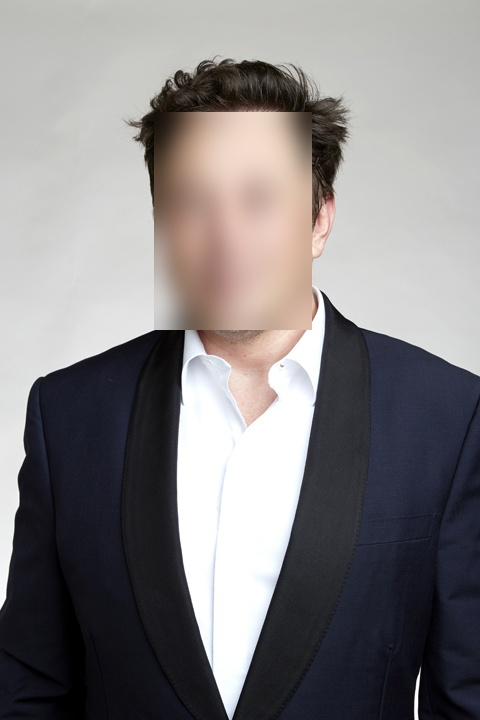

### **Face Detection & Blur Project: Anonymizing Faces with OpenCV**  


## **📌 Project Description**  
This project detects **faces** in images, videos, and webcam streams using **OpenCV's Deep Neural Networks (DNNs)** and applies **Gaussian blur** for privacy protection. It utilizes **pre-trained Caffe models** for accurate face detection.

🔹 **Detects faces in images, videos, and webcam feeds**  
🔹 **Applies Gaussian blur to detected faces for privacy preservation**  
🔹 **Supports real-time processing with FPS monitoring**  
🔹 **Saves output images and videos with blurred faces**  


## **📂 Project Structure**
```
📦 Detect Faces and Blur Faces
 ┣ 📂 models
 ┃ ┣ 📄 deploy.prototxt        # Network architecture for face detection
 ┃ ┗ 📄 res10_300x300_ssd_iter_140000_fp16.caffemodel  # Pre-trained model
 ┣ 📂 images
 ┃ ┗ 📄 musk.jpg               # Sample input image
 ┣ 📂 videos
 ┃ ┗ 📄 sample_video.mp4       # Sample input video
 ┣ 📂 output
 ┃ ┣ 📄 result1.jpg            # Processed image with blurred faces
 ┃ ┗ 📄 output_video.avi       # Processed video with blurred faces
 ┣ 📄 face_blur.py             # Main script for face detection and blurring
 ┗ 📄 README.md                # Project documentation
```


## **📌 How It Works**
1️⃣ **Loads input images, webcam feed, or videos**  
2️⃣ **Uses a pre-trained Caffe model for face detection**  
3️⃣ **Applies Gaussian blur to detected faces**  
4️⃣ **Displays and saves the processed images/videos**  


## **📌 Setup & Installation**
Make sure you have the required dependencies installed. Run:

```sh
pip install opencv-python opencv-python-headless numpy matplotlib
```


## **📌 Running the Project**
### **1. Face Detection & Blur on an Image**
Run the following command to process an image:

```sh
python face_blur.py --image images/musk.jpg
```


### **2. Face Detection & Blur on Webcam (Live)**
Run this command to blur faces in real-time from the webcam:

```sh
python face_blur.py --webcam
```


### **3. Face Detection & Blur on a Video**
Run this command to process a video and save the output:

```sh
python face_blur.py --video videos/sample_video.mp4
```


## **📸 Sample Results**

### **🔹 Before Detection**
#### **Original Image**
| Input Image |
|-|
|  |


### **🔹 After Detection**
#### **Blurred Faces**
| Processed Image |
|-|
|  |


## **🛠 Technologies Used**
- **Python** 🐍  
- **OpenCV DNN** 📷 (for face detection)  
- **Caffe Model** 🤖 (pre-trained deep learning model)  
- **Matplotlib** 📊 (for visualization)  

